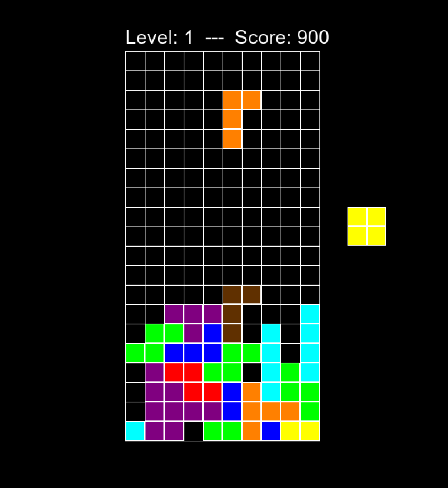

# ⚡ DQN-Powered Tetris AI

A personal project where I combine **Pygame** and **PyTorch** to explore **reinforcement learning (RL)** in a fun way: teaching an AI to play Tetris using a **Deep Q-Network (DQN)**.
The main goals for me are to **learn about RL**, **improve my Python programming skills**, and **get into Pygame game development**.

## ✨ Features

TODO

## 🔥 Status

The Tetris game itself is fully implemented.
The next steps of this project are going to be the implementation of the DQN agent, adding training analytics and visualizations, and finally providing a 1-player mode against an easy, medium, or hard AI.

## 📦 Installation

TODO

## 🚀 Usage

TODO
